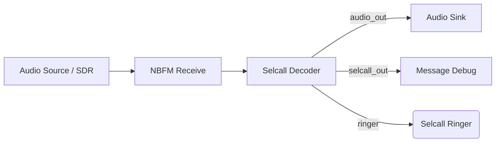
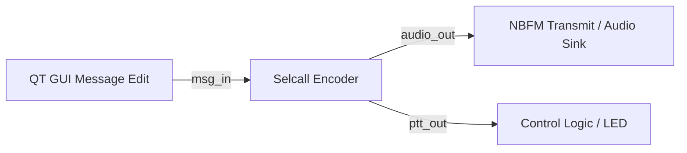
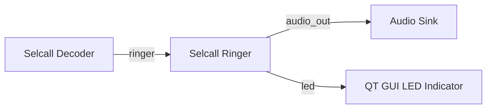

# gr-selcal - GNU Radio SELCAL Decoder & Encoder
gr-selcal is an Out-Of-Tree (OOT) module for GNU Radio dedicated to the encoding and decoding of analog selective calls (SelCall).
The module supports the most widely used standard protocols in PMR/LMR (ZVEI, CCIR) and offers advanced features such as code-based squelch control (Audio Gate) and automatic PTT signalling.

## 🚀 Core Features

* **Multi-Protocol Support:** `ZVEI-1`, `ZVEI-2`, `CCIR-1`, `CCIR-2`, `PCCIR`.


* **Decoder:**
  * Real-time tone recognition.
  * Filtering based on ‘Target Code’ (opens the audio only if it receives the correct selective).
  * Asynchronous message output (PMT) with decoding metadata.
  * Ringer output: sends a notification message when the target code is detected.


* **Encoder:**
  * Generation of the complete sequence: `Destination` + `Pause` +`Source`.
  * Automatic management of repeat tones (e.g. “E”).
  * **PTT (ptt_out)** signalling via asynchronous message to activate transmitters or GUI.

* **Ringer Block:**
  * Audible alert generator with a two-tone siren 🚒.
  * Visual indicator output via asynchronous message.

## 🛠️ ️Installation
### Prerequisites

* GNU Radio 3.8 or higher (tested on 3.10).
* Python 3.
* Standard libraries: `numpy`.
* CMake 3.5 or higher.

### Compilation
Compilation can be performed manually or using the `install.sh` script. 
```bash
mkdir build
cd build
cmake ..
make
sudo make install
sudo ldconfig
```
### Installation with Script
Alternatively, you can use the installation script provided:
```bash
chmod +x install.sh
./install.sh
```

> After installation, you will find the blocks in GNU Radio Companion under the category **[SelCall]**.

---

## 📖 GNURadio Blocks Documentation

### 1. Selcall Decoder

This block listens to an audio stream, decodes the tones, and only lets the audio through when a specific sequence is detected.

**Input:**
* `audio_in` (Float): Demodulated audio stream (e.g., output of an NBFM Receive).

**Output:**
* `audioout` (Float): ‘Gated’ audio stream. Contains the original audio only when the gate is open, otherwise silence.
* `selcall_out` (Message): PMT message containing the decoded code, timestamp and match status.
* `ringer` (Message): PMT message that sends a notification when the target code is detected.

**Parameters:**
* **Protocol:** Standard to be used (e.g. ZVEI-1).
* **Target Code:** The selective code that opens the squelch (e.g. ‘12345’).
* **Code Length:** Expected length of the selective code (usually 5).
* **Tone Duration:** Duration of each tone in milliseconds (e.g. 100 ms).
* **Sample Rate:** Sampling frequency (e.g. 48000).
* **Debug Mode:** Enables the output of detailed debug messages.

---

### 2. Selcall Encoder

This block generates the audio tone sequence to make a call. It automatically combines the personal ID (Source) with the recipient ID received via message.

**Sending logic:**
When it receives a message ‘12345’ on `msg_in`, and the `Personal Code` is ‘99999’, it will generate tones for:
`99999` (Source) → `PAUSE` → `12345` (Destination).

**Input:**
* `msg_in` (Message): The **Destination** code (string).

**Output:**
* `audio_out` (Float): The generated audio tones (to be sent to an Audio Sink or NBFM Transmit).
* `ptt_out` (Message): Boolean signal. Sends `True` (PTT ON) at the start of transmission and `False` (PTT OFF) at the end.

**Parameters:**
* **Protocol:** Standard to use.
* **Personal Code (Source):** Your unique ID that will be prefixed to each transmission.
* **Amplitude:** Tone volume (0.0 - 1.0).
* **Sample Rate:** Sampling frequency (e.g. 48000).

---

### 3. Selcall Ringer
This block functions as an audible alert generator, typically triggered when a specific selective call is successfully decoded. It produces a distinctive two-tone alarm (European Siren style: 800Hz / 1010Hz) and provides a status signal for visual indicators.


**Input:**
* `trigger` (Message): Any asynchronous message received on this port starts (or restarts) the alarm timer.


**Output:**
* `audio_out` (Float): The generated alarm audio stream. Contains the two-tone siren signal when active, otherwise silence.
* `led` (Message): Boolean signal. Sends True when the alarm starts and False when the duration expires. Designed to drive a QT GUI LED Indicator.

**Parameters:**
* **Duration:** Length of the alarm in seconds (e.g. 5.0).
* **Amplitude:** Audio volume level (0.0 - 1.0).
* **Sample Rate:** Sampling frequency (must match the audio sink).
---

## ⚡ Example of Use (Flowgraph)

### Decoder



### Encoder


### Ringer

---
## 🤝 Authors
* **Rocchio Pietro**
* **De Cao Andrea**
* **Marku Juri**

## 📄 Licenza
This project is released under the MIT licence. See the [LICENCE](LICENSE) file for details.